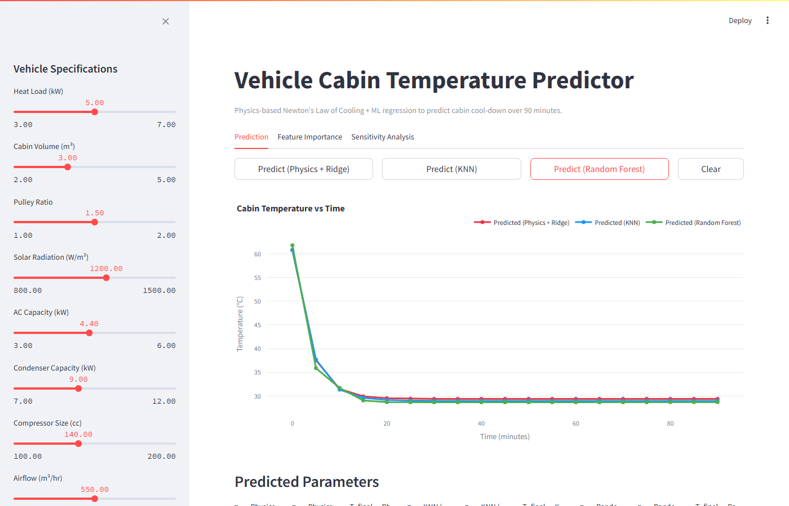

# Vehicle Cabin Temperature Predictor

## Overview

This app predicts the **cabin cool-down curve** for any vehicle over a 90-minute window after the AC is switched on. Given 14 vehicle specifications (heat load, cabin volume, compressor size, airflow, EBHS, etc.), it outputs the full temperature-vs-time curve at 5-minute intervals.

**Why it matters:**
- AC system engineers can evaluate cool-down performance before a physical prototype exists
- Reduces costly hardware test cycles by screening designs in simulation
- Three ML approaches are compared side by side so engineers can see where physics-based and data-driven methods agree or diverge

**Three approaches modeled:**
1. Physics-Informed Ridge Regression — Newton's Law of Cooling with 4-segment architecture
2. K-Nearest Neighbors (k=3) — similarity search over the 14-vehicle training set
3. Random Forest — direct temperature prediction treating time as an explicit feature

---

## Live Demo

### Screenshot



> **Note:** Run the app and take a screenshot of the Prediction tab (showing all 3 model curves), then save it as `docs/screenshot.png`.

### Run Locally

```bash
# Terminal 1 — start the API
uvicorn backend.main:app --reload --port 8000

# Terminal 2 — start the UI
streamlit run frontend/app.py
```

- Frontend: http://localhost:8501
- API docs: http://localhost:8000/docs

---

## Project Architecture

```
┌─────────────────────────────────────────┐
│        Streamlit Frontend               │
│             (port 8501)                 │
│  Prediction · Feature Importance ·      │
│  Sensitivity Analysis · Training Data   │
└──────────────────┬──────────────────────┘
                   │  HTTP REST API
                   │  POST /predict
                   │  GET  /vehicles
                   │  GET  /feature-importance
┌──────────────────┴──────────────────────┐
│         FastAPI Backend                 │
│             (port 8000)                 │
│  Request validation (Pydantic)          │
│  Method routing · CORS middleware       │
└──────────────────┬──────────────────────┘
                   │
┌──────────────────┴──────────────────────┐
│       ML Model Layer                    │
│   scikit-learn + scipy                  │
│                                         │
│  ┌─────────────────────────────────┐    │
│  │  Physics Ridge (4-segment)      │    │
│  │  KNN (k=3, 21 eng. features)    │    │
│  │  Random Forest (266 samples)    │    │
│  └─────────────────────────────────┘    │
└──────────────────┬──────────────────────┘
                   │
┌──────────────────┴──────────────────────┐
│       Training Data                     │
│   14 vehicles · 19 time steps           │
│   vehicles_combined.csv                 │
└─────────────────────────────────────────┘
```

---

## Data Description

| Property | Value |
|---|---|
| Vehicles | 14 (V1–V14) |
| Time steps | 19 (0, 5, 10, … 90 min) |
| Input features | 14 raw specs per vehicle |
| Target | Temperature curve (°C) |

### Raw Input Features

| Feature | Unit | Physical Description |
|---|---|---|
| `heat_load_kw` | kW | Total internal heat load (passengers, electronics, solar ingress) |
| `cabin_volume_m3` | m³ | Interior air volume to be cooled |
| `pulley_ratio` | — | Ratio of engine RPM to compressor RPM |
| `solar_w_m2` | W/m² | Solar irradiance incident on the vehicle |
| `ac_unit_capacity_kw` | kW | Rated cooling capacity of the AC system |
| `condenser_capacity_kw` | kW | Heat rejection capacity of the condenser |
| `compressor_size_cc` | cc | Compressor displacement volume per revolution |
| `airflow_m3_hr` | m³/hr | Blower airflow rate into the cabin |
| `soaking_time_hr` | hr | Hours the vehicle sat in the sun before testing |
| `rpm_0_30` | RPM | Engine speed during minutes 0–30 |
| `rpm_31_50` | RPM | Engine speed during minutes 31–50 |
| `rpm_51_70` | RPM | Engine speed during minutes 51–70 |
| `rpm_71_90` | RPM | Engine speed during minutes 71–90 |
| `ebhs` | cm² | **Equivalent Body Hole Size** — total effective gap area in the vehicle body; drives ambient heat infiltration rate |

> **EBHS (Equivalent Body Hole Size):** A vehicle body is never perfectly sealed — door seals, grommet gaps, and panel joints all allow hot outside air to leak in. EBHS aggregates all these gaps into a single equivalent orifice area (cm²). Higher EBHS means more infiltration and a higher steady-state cabin temperature.

---

## ML Approach

### 1. Physics-Informed Ridge Regression

Newton's Law of Cooling describes exponential approach to equilibrium:

```
T(t) = T_final + (T_soak - T_final) × exp(−t / τ)
```

**Architecture:**
- The 90-minute window is split into 4 RPM-matched segments: 0–30, 31–50, 51–70, 71–90 min
- Each segment has its own time constant `τ` predicted by a separate Ridge model
- `T_final` (equilibrium temperature) is predicted by a fifth Ridge model
- Segment isolation is enforced: the RPM features for band N can only influence temperatures within that band's window

**Why Ridge over plain Linear Regression:**
- Ridge (L2 regularization) shrinks coefficients toward zero, preventing overfitting on the small 14-vehicle dataset
- Keeps the coefficient signs physically interpretable (higher AC power → more negative coefficient → smaller τ)

**Feature engineering:** 6 features per segment model, drawn from the isolated feature set for that RPM band.

---

### 2. K-Nearest Neighbors (k=3)

Similarity-based approach with no parametric assumptions:
- Computes distances in the 21-dimensional engineered feature space (StandardScaler normalised)
- Finds the 3 most similar training vehicles
- Predicts `[τ_s1, τ_s2, τ_s3, τ_s4, T_final]` as the distance-weighted mean of those 3 neighbours
- Reconstructs the curve using the same 4-segment Newton formula

This method is most reliable when the query vehicle closely resembles one or more training vehicles.

---

### 3. Random Forest

Direct temperature prediction treating time as an explicit input feature:
- Training data is expanded to long format: 14 vehicles × 19 time points = **266 samples**
- Each sample is `[21 engineered features, time_min] → temperature`
- 100 decision trees, `max_depth=4`, `random_state=42`
- Captures non-linear feature interactions automatically (e.g., `airflow_heat_ratio` is ranked #1 by this model but not by Ridge)

---

## Feature Engineering

All 13 primary engineered features, their formulas, physical meaning, and which model uses them:

| Feature | Formula | Physical Meaning | Used By |
|---|---|---|---|
| `ac_power_{band}` | `compressor_size_cc × pulley_ratio × rpm_{band} / 1e6` | Actual AC mechanical power delivered in that RPM window | Ridge (per-segment), KNN, RF |
| `net_cooling_power` | `ac_capacity − heat_load − ebhs×0.003 − solar×0.001` | Net surplus cooling after all heat sources are subtracted | Ridge (T_final), KNN, RF |
| `sealing_quality` | `1 / (1 + ebhs/100)` | Normalised measure of how well-sealed the cabin is (0=open, 1=perfect) | Ridge (seg1, T_final), KNN, RF |
| `heat_load_fraction` | `heat_load_kw / ac_unit_capacity_kw` | Ratio of demand to supply — values > 1 mean the AC is undersized | Ridge (T_final), KNN, RF |
| `ac_per_volume` | `ac_unit_capacity_kw / cabin_volume_m3` | Cooling power density; higher = faster pull-down | Ridge (T_final), KNN, RF |
| `net_cooling_per_volume` | `net_cooling_power / cabin_volume_m3` | Volumetric surplus cooling | Ridge (T_final), KNN, RF |
| `heat_balance_ratio` | `(heat_load + ebhs×0.003 + solar×0.001) / ac_capacity` | Total heat burden relative to AC capacity | KNN, RF |
| `airflow_heat_ratio` | `(airflow × 1.2 × 1.006 × 10 / 3600) / heat_load_kw` | Sensible cooling power of airflow vs. heat load | KNN, RF |
| `thermal_mass` | `cabin_volume_m3 × 1.2 × 1.006` | Effective air thermal mass (kg·kJ/K) to be cooled | Ridge (all segs), KNN, RF |
| `tau_physics` | `thermal_mass / net_cooling_power` | Physics-derived time constant (minutes) | KNN, RF |
| `heat_density` | `heat_load_kw / cabin_volume_m3` | Heat load per unit volume | KNN, RF |
| `cooling_effectiveness` | `airflow_m3_hr / cabin_volume_m3` | Air changes per hour | KNN, RF |
| `rpm_drop` | `rpm_51_70 − rpm_71_90` | Engine deceleration at end of test — affects late-window compressor output | Ridge (seg4), KNN, RF |

> **EBHS appears in three engineered features:** `sealing_quality`, `net_cooling_power` (via the `ebhs×0.003` term), and `heat_balance_ratio`. This reflects its central role: EBHS sets the ambient infiltration heat load that the AC must overcome.

---

## Key Findings

1. **`net_cooling_power` is the single most important feature** for both `τ_s1` (initial pull-down speed) and `T_final` (equilibrium temperature) in the Ridge model. It integrates AC capacity, heat load, EBHS infiltration, and solar gain into one number.

2. **Cabin cooling completes within 15–20 minutes for all 14 training vehicles.** Fitted `τ_s1` values range from 3–5 minutes, meaning temperature is within ~5% of `T_final` well before the 30-minute mark.

3. **RPM bands 31–90 min show negligible effect on temperature.** Because cooling is essentially complete before minute 30, segments 2–4 operate near steady state. Predicting their `τ` values is ill-conditioned with the current dataset — more vehicles with slow or partial cool-down are needed.

4. **`airflow_heat_ratio` is the most important feature for Random Forest** (ranked #1 by Gini importance). The non-linear interaction between airflow and heat load is not captured by the linear Ridge model, which uses them as separate inputs.

5. **Physics validation: 4/4 checks pass.** The model correctly predicts the directional effect of every major design lever (see Physics Validation section below).

---

## Model Comparison

| Aspect | Physics + Ridge | KNN | Random Forest |
|---|---|---|---|
| Training samples needed | 14 | 14 | 266 (augmented) |
| Extrapolation ability | Good | Poor | Moderate |
| Interpretability | High | Medium | Low |
| Physics consistency | Enforced | Not enforced | Not enforced |
| Best for | New designs | Similar vehicles | Pattern discovery |
| Overfitting risk | Low (Ridge) | Low | Moderate |

---

## Physics Validation

Four directional tests verify that the Ridge model respects physical intuition:

| Test | Low value | High value | Direction | Result |
|---|---|---|---|---|
| Higher EBHS → higher T_final | ebhs=70 cm² | ebhs=190 cm² | T_final ↑ | ✅ PASS |
| Higher airflow → smaller τ_s1 | airflow=449 m³/hr | airflow=641 m³/hr | τ_s1 ↓ | ✅ PASS |
| Higher heat_load → higher T_final | heat=3.6 kW | heat=5.5 kW | T_final ↑ | ✅ PASS |
| Higher AC capacity → lower T_final | ac=4.4 kW | ac=5.4 kW | T_final ↓ | ✅ PASS |

---

## Future Work

1. **More training vehicles** — particularly vehicles with slow cool-down (τ > 10 min) to make segments 2–4 learnable

2. **Ambient temperature as input** — current model assumes fixed ambient; real predictions need ambient temp as a feature

3. **Neural network** — with 50+ vehicles, a small feedforward network (2 layers, 16 neurons) could capture segment interactions automatically

4. **Real-time prediction** — integrate with vehicle CAN bus data to predict remaining cool-down time during an actual test

5. **Uncertainty quantification** — add Gaussian Process or conformal prediction intervals so engineers know prediction confidence bounds

---

## Known Limitations

1. **Small dataset (14 vehicles).** Spurious correlations between features are possible due to the covariate structure of the training set. Ridge regularisation mitigates but does not eliminate this.

2. **All vehicles have fast cool-down (τ_s1 = 3–5 min).** The model has never seen a vehicle that takes longer than ~20 minutes to reach steady state. Predictions for sluggish designs (large cabin, weak AC) extrapolate beyond the training distribution.

3. **Segments 2–4 tau predictions degenerate.** Because temperature is near-flat in minutes 30–90 for all training vehicles, 9 of 14 vehicles hit the upper bound of the `τ` fitting window. The segment 2–4 Ridge models predict the mean rather than meaningful variation.

4. **Segment isolation trades accuracy for interpretability.** Enforcing that RPM band N features cannot influence temperatures outside window N is physically correct but reduces the number of training signals each model can see.

---

## How to Run

### Requirements

- Python 3.11+
- Git

### Setup

```bash
git clone git@github.com:Sohindoshi1009/vehicle-temp-predictor.git
cd vehicle-temp-predictor
python -m venv venv
venv\Scripts\activate        # Windows
# source venv/bin/activate   # macOS / Linux
pip install -r requirements.txt
```

### Run

```bash
# Terminal 1 — API backend
uvicorn backend.main:app --reload --port 8000

# Terminal 2 — Streamlit frontend
streamlit run frontend/app.py
```

### Access

| Service | URL |
|---|---|
| Frontend UI | http://localhost:8501 |
| API (interactive docs) | http://localhost:8000/docs |
| API (ReDoc) | http://localhost:8000/redoc |

---

## Tech Stack

| Library | Version | Role |
|---|---|---|
| FastAPI | 0.111.0 | REST API backend |
| Uvicorn | 0.29.0 | ASGI server |
| Streamlit | 1.35.0 | ML web UI frontend |
| scikit-learn | 1.4.2 | Ridge, KNN, Random Forest |
| scipy | 1.13.0 | Physics curve fitting (`curve_fit`) |
| plotly | 5.22.0 | Interactive charts |
| pandas | 2.2.2 | Data loading and manipulation |
| numpy | 1.26.4 | Numerical operations |
| pydantic | 2.7.1 | Request/response validation |

---

## Author

**Ishwari Shah** — Mobile Tech Lead

Built as part of an AI/ML certification roadmap:
**Azure AI-103 → AWS AIF-C01 → PMI-CPMAI**
